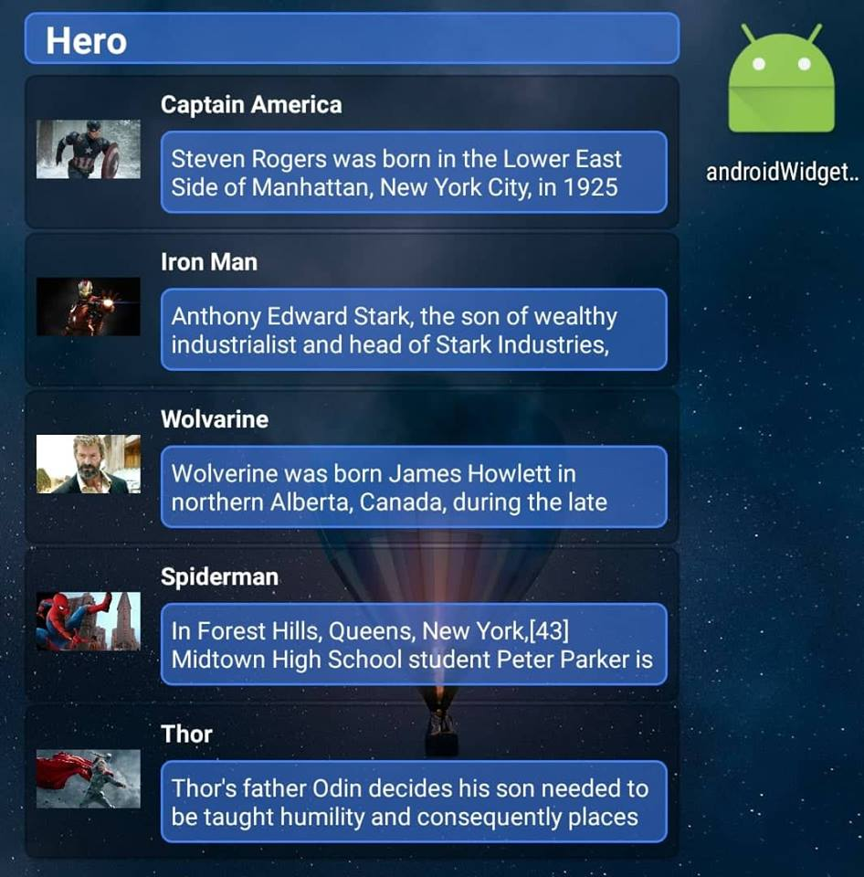

# React Native: Widget

[](https://github.com/gaetanozappi/react-native-widget-listview)
[](https://github.com/gaetanozappi/react-native-widget-listview/issues)



-   [Usage](#usage)
-   [License](#license)


## Usage

Copy the following file:
[widgetTask.js](widgetTask.js)

In the main path of the project.

Import the file you just copied into index.js and index.android.js.

Write in the files mentioned above, the following code:
```javascript
AppRegistry.registerHeadlessTask ('WidgetTask', () => WidgetTask);
```

Add to the manifest:

```diff
+ <uses-permission android:name="android.permission.INTERNET" />
+ <uses-permission android:name="android.permission.WRITE_EXTERNAL_STORAGE" />

+ <activity
+ android:name=".CustomReactActivity"
+ android:configChanges="keyboard|keyboardHidden|orientation|screenSize"
+ android:label="@string/app_name"
+ android:windowSoftInputMode="adjustResize">
 + <intent-filter>
  + <category android:name="android.intent.category.DEFAULT" />
 + </intent-filter>
+ </activity>

+ <receiver android:name="WidgetProvider">
 + <intent-filter>
  + <action android:name="android.appwidget.action.APPWIDGET_UPDATE" />
 + </intent-filter>
 + <meta-data android:name="android.appwidget.provider" android:resource="@xml/widgetprovider" />
+ </receiver>
+ <service android:name=".BackgroundTask" android:enabled="true" android:label="BackgroundAdd" />
+ <service android:name=".WidgetService" android:permission="android.permission.BIND_REMOTEVIEWS" />
```

Copy the files that are in the following locations:
```diff
android\app\src\main\java\com\androidwidgetpoc\
android\app\src\main\java\com\androidwidgetpoc\
android\app\src\main\res\xml\
android\app\src\main\res\layout\
android\app\src\main\res\drawable\
```

## License
The MIT License
